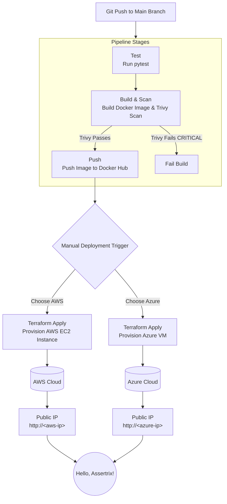

# Pre-Interview Assessment Implementation

## Overview
This repository contains my implementation for the pre-interview assessment. The technologies I selected to solve this challenge are:
•	**Python (Flask)** for the application code.
•	**GitHub Actions** for the CI/CD automation pipeline.
•	**Docker** for containerization.
•	**Terraform** for Infrastructure as Code (IaC).
•	**Microsoft Azure** as the primary cloud provider for deployment, with parallel support for AWS.
•	**Trivy** for container security scanning.

I chose this approach to be secure, automated, and follows DevOps best practices based on the use case set for this test.

## Part 1: CI/CD Pipeline (GitHub Actions)

I chose Github actions for solving this test because of it's integration with GitHub, and how i have successfully used it on other project setups, also the smooth integration with scanning tools like trivy, For this test i didn't want anything complex so i could easily setup compared to managing a Jenkins server.

**File:** `.github/workflows/ci-cd.yml`

The pipeline follows the principles of **"shift-left" security** which is one thing i am usually keen on.

### Pipeline Stages:
1.	**Test:** Executes unit tests on the Python Flask application using pytest, ensuring code functionality before progression.
2.	**Build & Scan:**
    •	Builds the Docker image using a multi-stage Dockerfile for a minimal and secure footprint.
    •	**Security Integration:** It scans the built image for CRITICAL vulnerabilities, and i chose Trivy for this. The build would fail if any is found, preventing vulnerable builds deploying.
3.	**Push:** Upon a successful scan, the image is tagged with the Git commit SHA and pushed to Dockerhub.
4.	**Deploy (Manual Trigger):** Because i thought to implement a multi-cloud deployment setup (A good habit of mine) I set up a manual trigger allows for controlled deployment to either AWS or Azure using Terraform.

## Part 2: Infrastructure as Code (Terraform)

For my infra provisioning, it consists of version-controlling, reproducible, and self-documenting environments.

I made two separate environments for my iac:

### AWS Deployment (infra/aws/)
•	**Resources Provisioned:** VPC Security Group, EC2 Instance (t2.micro).
•	**Execution:** The EC2 instance is provisioned with user_data that automates the setup of Docker, authentication with Docker Hub, and deployment of the specific application container.
•	**Output:** The public IP address of the application server is displayed.

### Azure Deployment (infra/azure/)
•	**Resources Provisioned:** Resource Group, Virtual Network, Public IP, Network Security Group (NSG), Linux Virtual Machine (Standard_B1s).
•	**Execution:** I added a cloud-init script for the VM via Terraform to install Docker, log in to the registry, and run the container.
•	**Output:** The public IP address of the application server is displayed.

## Part 3: Security Integration

**Tool Selected:** Trivy
**Implementation:** I integrated it directly into the GitHub actions workflow post-build.

## Architecture Diagram:

## Part 4: SSL/TLS Implementation Plan

If i were to talk about how I would setup an SSL/TLS Implementation Plan, I would focus on automation, security, and maintenance.

### A. Implementation on AWS (Production-Grade)

**Tools/Services:**
•	**AWS Certificate Manager (ACM):** I would use this for provisioning and managing publicly trusted TLS certificates.
•	**Application Load Balancer (ALB):** I would use it terminate TLS connections, offloading cryptographic overhead from backend instances.
•	**Amazon Route 53:** Keeping and maintaining all DNS related tasks.

**Configuration Steps:**
1.	**Request Certificate:** I'm using ACM to request a public certificate for my domain (e.g., app.assetrix.com). Use DNS validation (automated via Route 53).
2.	**Create ALB:** I'll deploy an Application Load Balancer in public subnets.
3.	**Configure Listeners:**
    •	**HTTPS Listener (Port 443):** Attach the ACM certificate. Forward traffic to a target group containing my backend instances (EC2, ECS, EKS).
    •	**HTTP Listener (Port 80):** i would create a listener rule to redirect all HTTP traffic to HTTPS.
4.	**DNS:** Create an ALIAS record in Route 53 pointing my domain to the ALB's DNS name.
5.	**Security Hardening:** would be configuring the ALB's security policy to use a modern policy which uses TLSv1.2+ and strong ciphers.

**Automation & Renewal:**
•	The entire setup (VPC, ALB, Listeners, Route 53 records, WAF) would be defined in terraform so i can easily change resources.
•	ACM provides fully automated, managed certificate renewal. 

**Ongoing Security:**
•	**HTTPS Redirect:** The HTTP-to-HTTPS redirect on the ALB ensures no insecure access.
•	**Expiry Alerts:** As a backup measure, i would create a CloudWatch Alarm triggered by the ACM CertificateApproachingExpiry metric to notify via SNS if a certificate is within 30 days of expiry and hasn't been auto renewed.

### B. My Implementation on Linode would be:

**Tools/Services:**
•	**Let's Encrypt:** It is free and we have automated TLS certificates.
•	**Certbot**
•	**NGINX / Apache:** Web server on the Linode VM that would be used as a reverse proxy and terminate TLS.

**Configuration Steps:**
1.	**Install Certbot**
2.	**Run Certbot:** Execute sudo certbot --nginx. It will interactively obtain a certificate and automatically modify your NGINX configuration to use HTTPS.
3.	**Firewall:**  I'd ensure the Linode Cloud Firewall allows traffic on ports 80 (for ACME challenge) and 443.

**Automation & Renewal:**
•	Certbot automatically installs a systemd timer (a cron job) to attempt renewal twice daily.
•	This renewal process would automate during initial provisioning. My Terraform user_data or cloud-init script must install and schedule Certbot.
•	**Linode DNS:** If using Linode's DNS manager, Certbot can be configured with a DNS plugin for automatic domain validation which we can use for wildcard certificates.

**Ongoing Security:**
•	**Web Server Config:** Harden the SSL configuration in NGINX/Apache (disable TLSv1.0/1.1, prefer modern ciphers).

### Kubernetes Approach

For K8 I think I would use **cert-manager** to fully automate TLS management. Cert-manager would be configured with a Let's Encrypt Cluster Issuer And then Ingress resources with cert-manager.io/cluster-issuer: "letsencrypt-prod" would automatically trigger cert-manager to obtain a certificate from Let's Encrypt, store it in a Kubernetes Secret, and automatically renew it. The NGINX Ingress Controller would then use this secret to serve HTTPS traffic. This would give me a hands-off approach to certificate lifecycle management.

## How to Run my solution:

1.	**Set Secrets:** Configure all required secrets in GitHub.
2.	**Push to Main:** Push code to the main branch to trigger the build, test, scan, and push stages.
3.	**Deploy:** Manually trigger the workflow from the GitHub Actions tab, selecting the desired cloud provider (AWS or Azure).
4.	**Access:** The Terraform output will provide the public IP. Visit the public ip address
